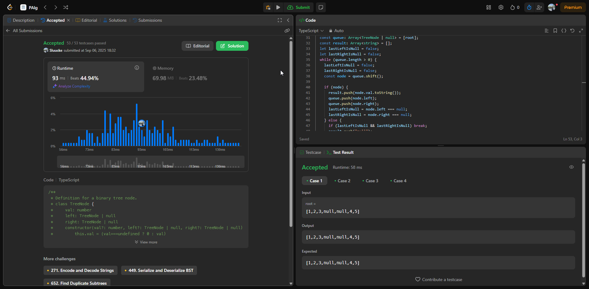
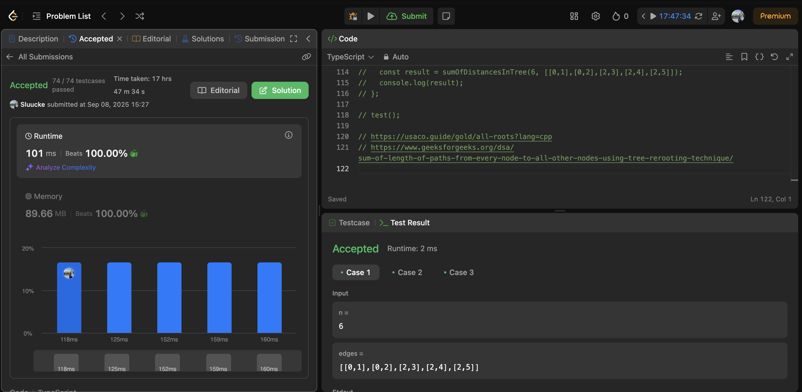
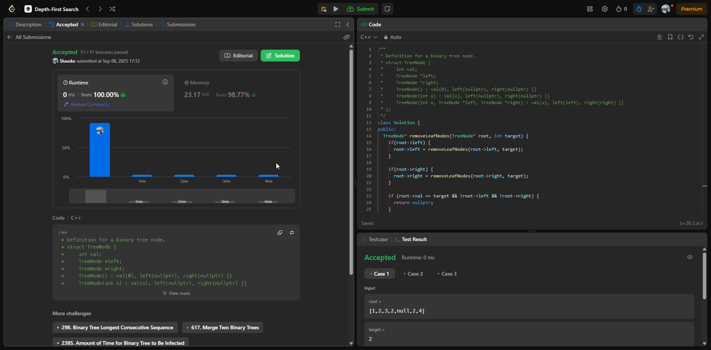

# Trabalho 1 - Grafos 1

**Número do trabalho:** 1  
**Conteúdo: Grafos 1**

## Alunos

| Matrícula |        Nome Completo       |
|:---------:|:-------------:|
| 232001649 | David William Lemos Ferreira |
| - | - |

## Definição do Trabalho

Este trabalho apresenta a resolução de 3 exercícios do Leet Code.

## Linguagens utilizadas

- C++
- Typescript ❤️

## Questões

| Questão | Nível  | Vídeo Explicando |
|---------|--------|------------------|
| [297. Serialize and Deserialize Binary Tree](https://leetcode.com/problems/serialize-and-deserialize-binary-tree) | Difícil | [Vídeo](https://www.tella.tv/video/projetos-de-algoritimos-or-grafos-1-egk2?t=13) |
| [834. Sum of Distances in Tree](https://leetcode.com/problems/sum-of-distances-in-tree) | Difícil | [Vídeo](https://www.tella.tv/video/projetos-de-algoritimos-or-grafos-1-egk2?t=144) |
| [1325. Delete Leaves With a Given Value](https://leetcode.com/problems/delete-leaves-with-a-given-value) | Médio | [Vídeo](https://www.tella.tv/video/projetos-de-algoritimos-or-grafos-1-egk2?t=340) |

## Screenshots

### Exercício 01 

### Exercício 02 

### Exercício 03 

## Vídeo de apresentação do Trabalho 1

**Arquivo:**

[Vídeo](resources/video-explicativo.mp4)

**Link:**

[Vídeo](https://www.tella.tv/video/projetos-de-algoritimos-or-grafos-1-egk2?t=340)